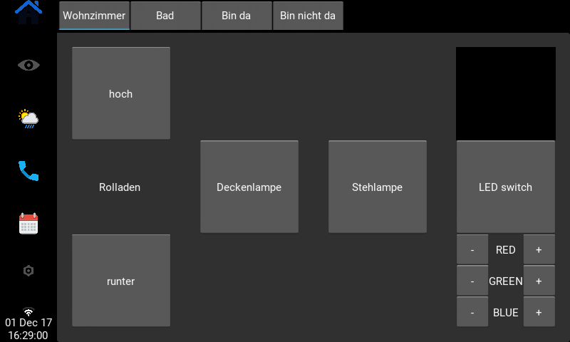
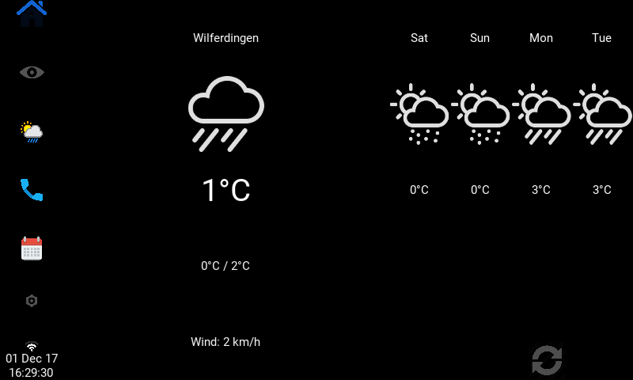
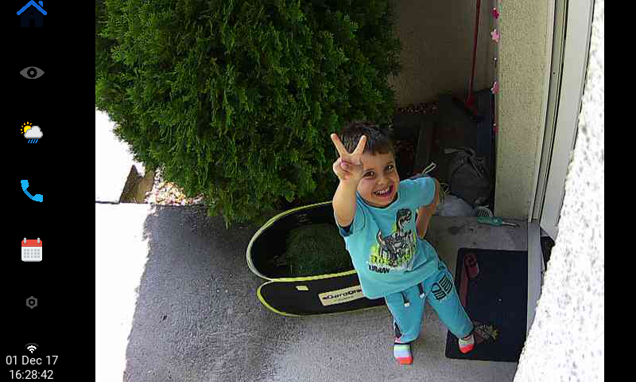
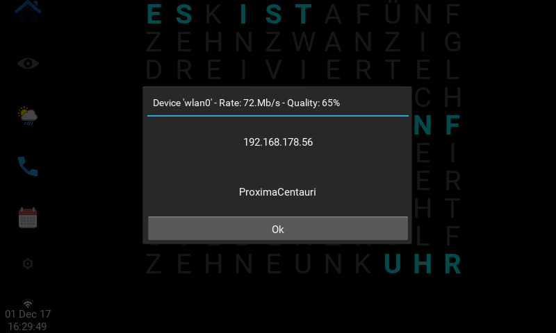

# pyHomeCtrl

Building a SmartHome-Control-Center based on a [Raspberry Pi with touchscreen](https://www.amazon.de/gp/product/B01LZNCZ3A).


## Screenshots
<table>
    <tr>
        <td>SmartHome</img></td>
        <td>Weather</img></td>
    </tr>
    <tr>
        <td>Cam</img></td>
        <td>Network</img></td>
    </tr>
</table>


## Installation

```
pip3 -m venv venv
. /venv/bin/activate
pip3 install -r requirements.txt

# if you'd like to be able to use the x11 window backend do:
export USE_X11=1
pip3 install git+https://github.com/kivy/kivy.git@master
```


### Backup

Kivy Build Dependencies:
sudo apt-get install -y \
    python3-pip \
    build-essential \
    git \
    python3 \
    python3-dev \
    ffmpeg \
    libsdl2-dev \
    libsdl2-image-dev \
    libsdl2-mixer-dev \
    libsdl2-ttf-dev \
    libportmidi-dev \
    libswscale-dev \
    libavformat-dev \
    libavcodec-dev \
    zlib1g-dev

sudo apt-get install -y \
    libgstreamer1.0 \
    gstreamer1.0-plugins-base \
    gstreamer1.0-plugins-good

```
# make sure pip, virtualenv and setuptools are updated
python3 -m pip install --upgrade --user pip virtualenv setuptools

# then create a virtualenv named "kivy_venv" in your home with:
python3 -m virtualenv ~/kivy_venv

# load the virtualenv
source ~/kivy_venv/bin/activate

# if you'd like to be able to use the x11 winodw backend do:
export USE_X11=1

# install the correct Cython version
pip3 install Cython==0.29.10

pip3 install git+https://github.com/kivy/kivy.git@master
```

Dependencies:
```
sudo pip3 install paho-mqtt
sudo pip3 install httplib2
sudo pip3 install --upgrade google-api-python-client
sudo pip3 install --upgrade oauth2client 
sudo pip3 install scapy
```
